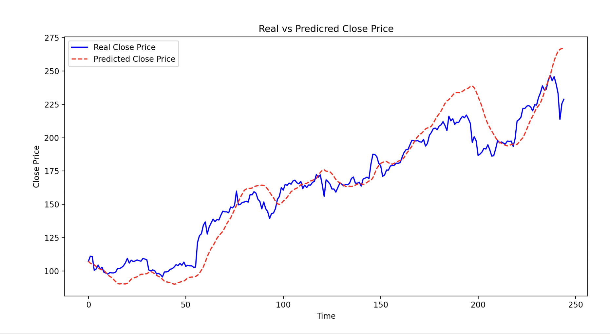

# NVIDIA Stock Price Prediction Project 

Project Overview  
This project explores the application of Long Short-Term Memory (LSTM) neural networks for predicting stock prices, specifically focusing on NVIDIA (NVDA) stock. The implementation combines various technical indicators with deep learning techniques to create a comprehensive prediction model. The project demonstrates the practical application of machine learning concepts in financial forecasting and showcases the integration of multiple data processing and modeling techniques. 

## 1. Data Preprocessing

### 1.1 Data Selection and Cleaning
- Used S&P 500 dataset from Kaggle, focusing on NVIDIA (NVDA) stock data
- Removed initial rows with NaN values resulting from technical indicator calculations
- Converted date column to datetime format and extracted temporal features:
  - Year
  - Month
  - Day of week
  - Day of year

### 1.2 Feature Engineering
The preprocessing pipeline includes the following steps:
1. Data splitting: 80% training, 20% testing
2. Feature normalization using MinMaxScaler (range 0-1)
3. Target variable scaling using separate MinMaxScaler
4. Time series data preparation using TimeseriesGenerator with 7-day window

## 2. Technical Indicators and Features

### 2.1 Price Movement Indicators
1. **Relative Strength Index (RSI)**
   - 14-day period calculation
   - Measures momentum and overbought/oversold conditions
   - Helps identify potential trend reversals

2. **Moving Average Convergence Divergence (MACD)**
   - Short-term EMA (12 days)
   - Long-term EMA (26 days)
   - Signal line (9-day EMA of MACD)
   - Identifies trend direction and momentum changes

3. **Bollinger Bands**
   - 20-day period with 2 standard deviations
   - Provides volatility-based price channels
   - Includes:
     - %B (price position within bands)
     - Bandwidth (volatility measurement)
     - Simple Moving Average (SMA)

### 2.2 Volume-Based Indicators
1. **Money Flow Index (MFI)**
   - 14-day period
   - Combines price and volume data
   - Identifies potential reversals and overbought/oversold conditions

2. **On-Balance Volume (OBV)**
   - Cumulative volume indicator
   - Measures buying/selling pressure
   - Confirms price trends

### 2.3 Additional Technical Features
1. **Fibonacci Retracement Levels**
   - 23.6%, 38.2%, 50.0%, and 61.8% levels
   - Identifies potential support/resistance levels
   - Uses 14-day rolling window

2. **Stochastic Oscillator**
   - 14-day period with 3-day SMA smoothing
   - Measures momentum and price position relative to range
   - Includes both %K and %D lines

## 3. Model Selection and Hyperparameter Tuning

### 3.1 Model Architecture
- Selected LSTM (Long Short-Term Memory) network due to its ability to:
  - Capture long-term dependencies
  - Handle time series data effectively
  - Learn complex patterns in sequential data

### 3.2 Hyperparameter Optimization
Used Optuna for hyperparameter optimization with the following parameters:

#### Best Parameters Found:
```yaml
units: 128
dropout_rate: 0.20738893400771446
learning_rate: 0.001748571344789048
batch_size: 64
epochs: 50
lstm_layers: 2
activation: relu
```

## 4. Model Performance Analysis

### 4.1 Prediction Results Visualization
The model's performance is visualized in the provided graph showing real vs predicted close prices for NVIDIA stock. Key observations from the visualization:

1. **Trend Capture**
   - The model successfully captures the overall upward trend of NVIDIA stock
   - Predictions (red dashed line) closely follow the actual prices (blue solid line)
   - Price range approximately $100-$275 over the testing period

2. **Pattern Recognition**
   - Strong performance in identifying major price movements
   - Particularly accurate in the middle section (time points 100-200)
   - Some lag in capturing sudden price changes

3. **Areas of Strong Performance**
   - Excellent tracking of gradual price increases
   - Good prediction of sustained trends
   - Accurate capture of medium-term price levels

4. **Areas for Improvement**
   - Slight underestimation in the initial period (time points 0-50)
   - Some overestimation in the final period (after time point 200)
   - Minor lag in capturing sharp price reversals

### 4.2 Key Performance Insights
1. **Model Strengths**
   - Reliable prediction of overall trend direction
   - Good accuracy during periods of steady price movement

2. **Potential Limitations**
   - Some delay in responding to sharp price changes
   - Tendency to smooth out extreme price movements

## 5.Model Evaluation Metrics 
### 5.1 Accuracy Metrics 
1. **Mean Absolute Error (MAE)**
   - Mean Absolute Error (MAE): 15.68
   - Average absolute difference between predicted and actual prices

2. **Root Mean Square Error (RMSE)**
   - Root Mean Square Error (RMSE): 17.50
   - Higher than MAE suggests presence of larger prediction errors


3. **Mean Absolute Percentage Error (MAPE)**

   - Mean Absolute Percentage Error (MAPE): 10.00%
   - Shows average percentage deviation of predictions


## 5.2 Model Fit Metrics   
1. **R-squared (R2)**
   - R-squared (R2): 0.822
   - Model explains 82.2% of price variance
   - Indicates strong predictive performance


2. **Maximum Drawdown**
   - Maximum Drawdown: -28.10%
   - Largest observed drop from peak in prediction accuracy


## 6. Conclusion
The LSTM model demonstrates strong performance in predicting NVIDIA stock prices, as evidenced by the close alignment between predicted and actual values in the visualization. While the model excels at capturing overall trends and sustained price movements, there is room for improvement in handling sudden price changes and extreme market conditions. The comprehensive technical indicator set and optimized hyperparameters contribute to the model's robust performance.

